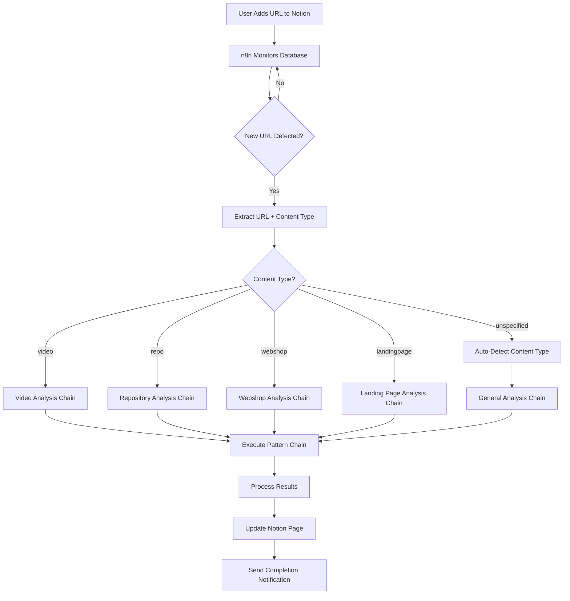

# Design Document

## Overview

The Notion Watcher Automation system creates an intelligent content processing pipeline that monitors Notion databases for new URLs and automatically executes appropriate Fabric AI pattern chains based on content type. The system uses n8n automation for reliable monitoring and webhook integration, supports five content types with specialized analysis workflows, and provides seamless integration with the existing Raycast Fabric AI extension for pattern execution and database export.

## Architecture

### High-Level Architecture

```
Notion Watcher Automation System
├── Monitoring Layer
│   ├── n8n Workflow Engine
│   ├── Notion Database Poller
│   ├── Webhook Receiver (optional)
│   └── Content Type Detector
├── Pattern Execution Engine
│   ├── Pattern Chain Orchestrator
│   ├── Content Type Router
│   ├── Fabric AI Integration
│   └── Result Processor
├── Content Analysis Workflows
│   ├── Video Analysis Chain
│   ├── Repository Analysis Chain
│   ├── Webshop Analysis Chain
│   ├── Landing Page Analysis Chain
│   └── General Analysis Chain
├── Integration Layer
│   ├── Raycast Extension API
│   ├── Notion API Client
│   ├── Content Fetcher
│   └── Status Manager
└── Monitoring & Logging
    ├── Process Monitor
    ├── Error Handler
    ├── Performance Tracker
    └── Notification System
```

### System Flow Diagram



## Content Type Analysis Workflows

### 1. Video Analysis Chain
**Target**: YouTube videos, educational content, podcasts, webinars
**Pattern Chain**: `extract_wisdom_dm → extract_questions → extract_primary_problem → extract_primary_solution → extract_instructions`

```typescript
interface VideoAnalysisResult {
  wisdom: {
    summary: string;
    keyInsights: string[];
    notableQuotes: string[];
    actionableItems: string[];
  };
  questions: {
    primaryQuestions: string[];
    followUpQuestions: string[];
    researchQuestions: string[];
  };
  problemSolution: {
    primaryProblem: string;
    problemContext: string;
    primarySolution: string;
    solutionSteps: string[];
  };
  instructions: {
    actionableSteps: string[];
    implementationGuidance: string;
    prerequisites: string[];
  };
  metadata: {
    title: string;
    channel: string;
    duration: string;
    publishDate: string;
  };
  priorityScore: number; // 1-10 based on relevance and actionability
}
```

### 2. Repository Analysis Chain
**Target**: GitHub repos, GitLab projects, open source projects
**Pattern Chain**: `explain_project → extract_instructions → analyze_tech_impact → create_coding_feature → extract_business_ideas`

```typescript
interface RepositoryAnalysisResult {
  projectExplanation: {
    purpose: string;
    keyFeatures: string[];
    targetAudience: string;
    technicalApproach: string;
  };
  instructions: {
    installationSteps: string[];
    usageExamples: string[];
    configurationOptions: string[];
    troubleshooting: string[];
  };
  techImpact: {
    innovationLevel: number;
    marketPotential: string;
    technicalComplexity: number;
    adoptionBarriers: string[];
  };
  codingFeatures: {
    suggestedFeatures: string[];
    implementationApproach: string[];
    technicalRequirements: string[];
  };
  businessIdeas: {
    commercialOpportunities: string[];
    marketApplications: string[];
    monetizationStrategies: string[];
  };
  metadata: {
    stars: number;
    forks: number;
    language: string;
    lastUpdated: string;
    license: string;
  };
}
```

### 3. Webshop Analysis Chain
**Target**: E-commerce sites, online stores, product pages
**Pattern Chain**: `extract_business_ideas → analyze_sales_call → create_hormozi_offer → extract_patterns → analyze_risk`

```typescript
interface WebshopAnalysisResult {
  businessIdeas: {
    businessModel: string;
    revenueStreams: string[];
    targetMarket: string;
    uniqueValueProposition: string;
  };
  salesAnalysis: {
    salesApproach: string;
    persuasionTechniques: string[];
    conversionElements: string[];
    customerJourney: string[];
  };
  offerAnalysis: {
    coreOffer: string;
    valueStack: string[];
    pricingStrategy: string;
    riskReversal: string[];
  };
  patterns: {
    designPatterns: string[];
    copywritingPatterns: string[];
    conversionPatterns: string[];
    userExperiencePatterns: string[];
  };
  riskAssessment: {
    competitiveThreats: string[];
    marketRisks: string[];
    operationalRisks: string[];
    mitigationStrategies: string[];
  };
}
```

### 4. Landing Page Analysis Chain
**Target**: Marketing pages, product launches, service pages
**Pattern Chain**: `convert_to_markdown → analyze_wireframe_flow → analyze_copywriting_score → create_storybrand_variant → create_competitive_audit`

```typescript
interface LandingPageAnalysisResult {
  pageStructure: {
    markdownContent: string;
    sectionsIdentified: string[];
    contentHierarchy: string[];
  };
  uxAnalysis: {
    userFlow: string[];
    conversionFunnel: string[];
    frictionPoints: string[];
    optimizationOpportunities: string[];
    mobileExperience: string;
  };
  copywritingScore: {
    overallScore: number;
    headlineEffectiveness: number;
    valuePropositionClarity: number;
    persuasionTechniques: string[];
    callToActionAnalysis: string[];
  };
  storyBrandAnalysis: {
    heroIdentification: string;
    problemDefinition: string;
    guidePositioning: string;
    planPresentation: string[];
    callToAction: string;
    successVision: string;
    failureStakes: string;
  };
  competitiveAudit: {
    positioning: string;
    strengths: string[];
    weaknesses: string[];
    opportunities: string[];
    threats: string[];
    strategicRecommendations: string[];
  };
}
```

### 5. General Analysis Chain
**Target**: Unspecified content, mixed content types, fallback analysis
**Pattern Chain**: `extract_wisdom_dm → summarize → extract_main_idea → extract_recommendations`

```typescript
interface GeneralAnalysisResult {
  wisdom: {
    summary: string;
    keyInsights: string[];
    notableQuotes: string[];
    references: string[];
  };
  summary: {
    oneSentenceSummary: string;
    mainPoints: string[];
    keyTakeaways: string[];
  };
  mainIdea: {
    coreMessage: string;
    supportingPoints: string[];
    implications: string[];
  };
  recommendations: {
    actionableRecommendations: string[];
    nextSteps: string[];
    relatedResources: string[];
  };
  detectedContentType: string; // Auto-detected type for future reference
}
```

## Technical Implementation

### n8n Workflow Configuration

```json
{
  "name": "Notion URL Watcher",
  "nodes": [
    {
      "name": "Schedule Trigger",
      "type": "n8n-nodes-base.scheduleTrigger",
      "parameters": {
        "rule": {
          "interval": [
            {
              "field": "minutes",
              "value": 10
            }
          ]
        }
      }
    },
    {
      "name": "Notion Database Query",
      "type": "n8n-nodes-base.notion",
      "parameters": {
        "operation": "getAll",
        "resource": "databasePage",
        "databaseId": "{{$env.NOTION_DATABASE_ID}}",
        "filters": {
          "conditions": [
            {
              "property": "Status",
              "condition": "equals",
              "value": "New"
            }
          ]
        }
      }
    },
    {
      "name": "Process New URLs",
      "type": "n8n-nodes-base.function",
      "parameters": {
        "functionCode": "// Extract URL and content type from Notion page\nconst items = $input.all();\nconst newUrls = [];\n\nfor (const item of items) {\n  const url = item.json.properties.URL?.url;\n  const contentType = item.json.properties['Content Type']?.select?.name || 'unspecified';\n  const pageId = item.json.id;\n  \n  if (url) {\n    newUrls.push({\n      url,\n      contentType,\n      pageId,\n      title: item.json.properties.Name?.title[0]?.plain_text || 'Untitled'\n    });\n  }\n}\n\nreturn newUrls.map(item => ({ json: item }));"
      }
    },
    {
      "name": "Trigger Raycast Analysis",
      "type": "n8n-nodes-base.httpRequest",
      "parameters": {
        "method": "POST",
        "url": "http://localhost:3000/api/analyze-url",
        "options": {
          "headers": {
            "Content-Type": "application/json",
            "Authorization": "Bearer {{$env.RAYCAST_API_TOKEN}}"
          }
        },
        "body": {
          "url": "={{$json.url}}",
          "contentType": "={{$json.contentType}}",
          "notionPageId": "={{$json.pageId}}"
        }
      }
    },
    {
      "name": "Update Notion Status",
      "type": "n8n-nodes-base.notion",
      "parameters": {
        "operation": "update",
        "resource": "databasePage",
        "pageId": "={{$json.pageId}}",
        "properties": {
          "Status": {
            "select": {
              "name": "Processing"
            }
          },
          "Processing Started": {
            "date": {
              "start": "={{new Date().toISOString()}}"
            }
          }
        }
      }
    }
  ]
}
```

### Raycast Extension API Integration

```typescript
// New API endpoint in Raycast extension
class NotionWatcherAPI {
  private patternChainExecutor: PatternChainExecutor;
  private notionClient: NotionClient;
  
  async analyzeUrl(request: AnalysisRequest): Promise<AnalysisResponse> {
    try {
      // Update status to processing
      await this.updateNotionStatus(request.notionPageId, 'Processing');
      
      // Determine pattern chain based on content type
      const patternChain = this.getPatternChain(request.contentType);
      
      // Execute pattern chain
      const results = await this.patternChainExecutor.executeChain(
        patternChain,
        request.url
      );
      
      // Process and structure results
      const structuredResults = this.structureResults(results, request.contentType);
      
      // Update Notion page with results
      await this.updateNotionWithResults(request.notionPageId, structuredResults);
      
      // Update status to completed
      await this.updateNotionStatus(request.notionPageId, 'Completed');
      
      return {
        success: true,
        results: structuredResults,
        processingTime: Date.now() - request.startTime
      };
      
    } catch (error) {
      await this.handleError(request.notionPageId, error);
      throw error;
    }
  }
  
  private getPatternChain(contentType: string): string[] {
    const chains = {
      video: ['extract_wisdom_dm', 'extract_questions', 'extract_primary_problem', 'extract_primary_solution', 'extract_instructions'],
      repo: ['explain_project', 'extract_instructions', 'analyze_tech_impact', 'create_coding_feature', 'extract_business_ideas'],
      webshop: ['extract_business_ideas', 'analyze_sales_call', 'create_hormozi_offer', 'extract_patterns', 'analyze_risk'],
      landingpage: ['convert_to_markdown', 'analyze_wireframe_flow', 'analyze_copywriting_score', 'create_storybrand_variant', 'create_competitive_audit'],
      unspecified: ['extract_wisdom_dm', 'summarize', 'extract_main_idea', 'extract_recommendations']
    };
    
    return chains[contentType] || chains.unspecified;
  }
  
  private async updateNotionWithResults(pageId: string, results: any): Promise<void> {
    const properties = this.formatResultsForNotion(results);
    
    await this.notionClient.pages.update({
      page_id: pageId,
      properties: {
        ...properties,
        'Processing Completed': {
          date: { start: new Date().toISOString() }
        },
        'Status': {
          select: { name: 'Completed' }
        }
      }
    });
    
    // Add detailed results as page content
    await this.addResultsAsPageContent(pageId, results);
  }
}
```

### Content Type Detection System

```typescript
class ContentTypeDetector {
  async detectContentType(url: string): Promise<string> {
    try {
      // Check URL patterns first
      if (this.isVideoUrl(url)) return 'video';
      if (this.isRepositoryUrl(url)) return 'repo';
      
      // Fetch page content for deeper analysis
      const content = await this.fetchPageContent(url);
      const analysis = await this.analyzePageContent(content);
      
      return this.determineContentType(analysis);
      
    } catch (error) {
      console.warn('Content type detection failed:', error);
      return 'unspecified';
    }
  }
  
  private isVideoUrl(url: string): boolean {
    const videoPatterns = [
      /youtube\.com\/watch/,
      /youtu\.be\//,
      /vimeo\.com\//,
      /twitch\.tv\//,
      /tiktok\.com\//
    ];
    
    return videoPatterns.some(pattern => pattern.test(url));
  }
  
  private isRepositoryUrl(url: string): boolean {
    const repoPatterns = [
      /github\.com\/[^\/]+\/[^\/]+$/,
      /gitlab\.com\/[^\/]+\/[^\/]+$/,
      /bitbucket\.org\/[^\/]+\/[^\/]+$/
    ];
    
    return repoPatterns.some(pattern => pattern.test(url));
  }
  
  private async analyzePageContent(content: string): Promise<ContentAnalysis> {
    // Use AI to analyze page content and determine type
    const analysis = await this.aiAnalyzer.analyze(content, {
      task: 'content_type_detection',
      options: ['webshop', 'landingpage', 'blog', 'documentation', 'general']
    });
    
    return analysis;
  }
}
```

## Error Handling and Recovery

### Error Handling Strategy

```typescript
class ErrorHandler {
  async handleProcessingError(
    error: Error,
    context: ProcessingContext
  ): Promise<ErrorResponse> {
    const errorType = this.classifyError(error);
    
    switch (errorType) {
      case 'NETWORK_ERROR':
        return this.handleNetworkError(error, context);
      case 'CONTENT_ACCESS_ERROR':
        return this.handleContentAccessError(error, context);
      case 'PATTERN_EXECUTION_ERROR':
        return this.handlePatternExecutionError(error, context);
      case 'NOTION_API_ERROR':
        return this.handleNotionApiError(error, context);
      default:
        return this.handleUnknownError(error, context);
    }
  }
  
  private async handleNetworkError(
    error: Error,
    context: ProcessingContext
  ): Promise<ErrorResponse> {
    // Implement retry logic with exponential backoff
    const maxRetries = 3;
    let retryCount = 0;
    
    while (retryCount < maxRetries) {
      try {
        await this.delay(Math.pow(2, retryCount) * 1000);
        return await this.retryProcessing(context);
      } catch (retryError) {
        retryCount++;
      }
    }
    
    // If all retries failed, mark for manual review
    await this.markForManualReview(context.notionPageId, error);
    return { success: false, error: 'Network error after retries' };
  }
  
  private async handleContentAccessError(
    error: Error,
    context: ProcessingContext
  ): Promise<ErrorResponse> {
    // Try alternative content extraction methods
    const alternatives = [
      () => this.tryArchiveVersion(context.url),
      () => this.tryMetadataOnly(context.url),
      () => this.tryGeneralAnalysis(context.url)
    ];
    
    for (const alternative of alternatives) {
      try {
        const result = await alternative();
        if (result.success) {
          await this.updateNotionWithPartialResults(context.notionPageId, result);
          return result;
        }
      } catch (altError) {
        console.warn('Alternative method failed:', altError);
      }
    }
    
    await this.markForManualReview(context.notionPageId, error);
    return { success: false, error: 'Content access failed' };
  }
}
```

## Performance Optimization

### Caching Strategy

```typescript
class PerformanceOptimizer {
  private cache: Map<string, CachedResult> = new Map();
  private readonly CACHE_TTL = 24 * 60 * 60 * 1000; // 24 hours
  
  async getCachedResult(url: string, contentType: string): Promise<CachedResult | null> {
    const cacheKey = this.generateCacheKey(url, contentType);
    const cached = this.cache.get(cacheKey);
    
    if (cached && !this.isCacheExpired(cached)) {
      return cached;
    }
    
    return null;
  }
  
  async setCachedResult(
    url: string,
    contentType: string,
    result: AnalysisResult
  ): Promise<void> {
    const cacheKey = this.generateCacheKey(url, contentType);
    const cachedResult: CachedResult = {
      result,
      timestamp: Date.now(),
      contentHash: this.generateContentHash(result)
    };
    
    this.cache.set(cacheKey, cachedResult);
    
    // Implement cache size limits
    if (this.cache.size > 1000) {
      this.evictOldestEntries();
    }
  }
  
  private generateCacheKey(url: string, contentType: string): string {
    return `${contentType}:${this.hashUrl(url)}`;
  }
  
  private isCacheExpired(cached: CachedResult): boolean {
    return Date.now() - cached.timestamp > this.CACHE_TTL;
  }
}
```

### Batch Processing

```typescript
class BatchProcessor {
  private processingQueue: ProcessingJob[] = [];
  private readonly MAX_CONCURRENT = 3;
  private readonly BATCH_SIZE = 5;
  
  async addToQueue(job: ProcessingJob): Promise<void> {
    this.processingQueue.push(job);
    
    if (this.processingQueue.length >= this.BATCH_SIZE) {
      await this.processBatch();
    }
  }
  
  private async processBatch(): Promise<void> {
    const batch = this.processingQueue.splice(0, this.BATCH_SIZE);
    const chunks = this.chunkArray(batch, this.MAX_CONCURRENT);
    
    for (const chunk of chunks) {
      await Promise.all(
        chunk.map(job => this.processJob(job))
      );
    }
  }
  
  private async processJob(job: ProcessingJob): Promise<void> {
    try {
      await this.updateJobStatus(job.id, 'processing');
      const result = await this.executePatternChain(job);
      await this.updateJobStatus(job.id, 'completed');
      await this.saveResults(job, result);
    } catch (error) {
      await this.updateJobStatus(job.id, 'failed');
      await this.handleJobError(job, error);
    }
  }
}
```

## Monitoring and Analytics

### System Monitoring

```typescript
class SystemMonitor {
  private metrics: SystemMetrics = {
    totalProcessed: 0,
    successRate: 0,
    averageProcessingTime: 0,
    errorsByType: new Map(),
    contentTypeDistribution: new Map()
  };
  
  async recordProcessingAttempt(
    contentType: string,
    processingTime: number,
    success: boolean,
    error?: Error
  ): Promise<void> {
    this.metrics.totalProcessed++;
    
    if (success) {
      this.updateSuccessMetrics(processingTime);
    } else {
      this.updateErrorMetrics(error);
    }
    
    this.updateContentTypeDistribution(contentType);
    await this.persistMetrics();
  }
  
  async getSystemHealth(): Promise<SystemHealth> {
    return {
      status: this.determineSystemStatus(),
      metrics: this.metrics,
      recentErrors: await this.getRecentErrors(),
      performanceTrends: await this.getPerformanceTrends()
    };
  }
  
  private determineSystemStatus(): 'healthy' | 'degraded' | 'critical' {
    if (this.metrics.successRate > 0.95) return 'healthy';
    if (this.metrics.successRate > 0.80) return 'degraded';
    return 'critical';
  }
}
```

## Implementation Phases

### Epic 1: Core Infrastructure
**Phase 1A: n8n Workflow Setup**
- Configure n8n workflow for Notion database monitoring
- Implement URL detection and content type extraction
- Set up webhook endpoints and polling mechanisms

**Phase 1B: Raycast API Integration**
- Create API endpoints in Raycast extension for external triggers
- Implement authentication and security for API access
- Add pattern chain execution capabilities via API

### Epic 2: Content Analysis Workflows
**Phase 2A: Pattern Chain Implementation**
- Implement video analysis pattern chain
- Create repository analysis workflow
- Build webshop analysis chain

**Phase 2B: Advanced Analysis Workflows**
- Implement landing page analysis chain (requires custom patterns)
- Create general analysis fallback workflow
- Add content type auto-detection system

### Epic 3: Integration & Error Handling
**Phase 3A: Notion Integration**
- Implement result formatting and Notion page updates
- Add status tracking and progress indicators
- Create structured result organization system

**Phase 3B: Error Handling & Recovery**
- Implement comprehensive error handling
- Add retry logic and alternative processing methods
- Create manual review and notification systems

### Epic 4: Performance & Monitoring
**Phase 4A: Performance Optimization**
- Implement caching and batch processing
- Add performance monitoring and metrics
- Optimize pattern execution for automation context

**Phase 4B: System Monitoring**
- Create monitoring dashboard and alerts
- Implement usage analytics and reporting
- Add system health checks and maintenance tools

This design provides a comprehensive automation system that transforms passive URL saving into active content analysis and insight generation.