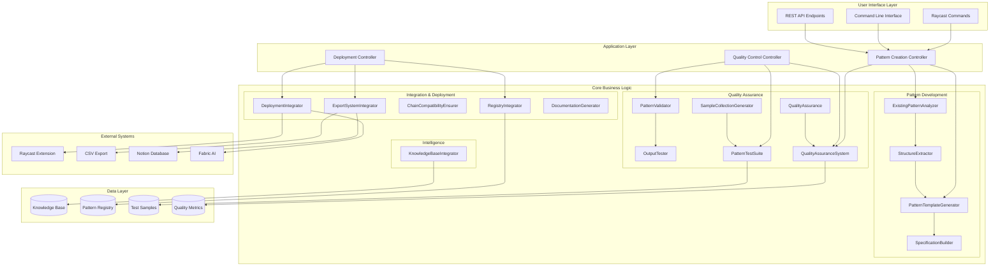
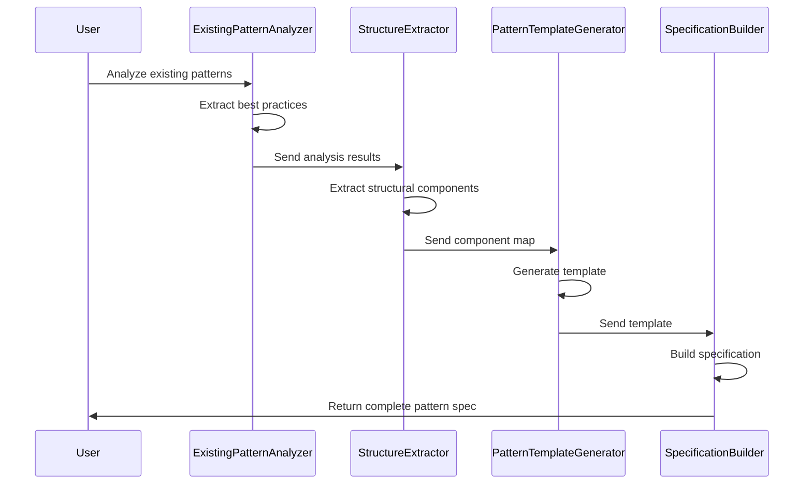
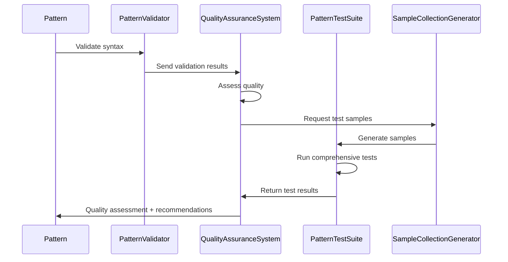
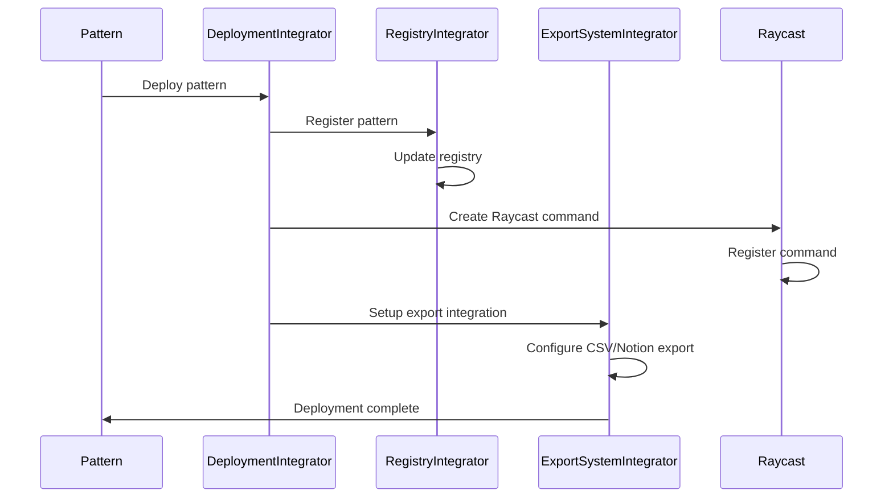
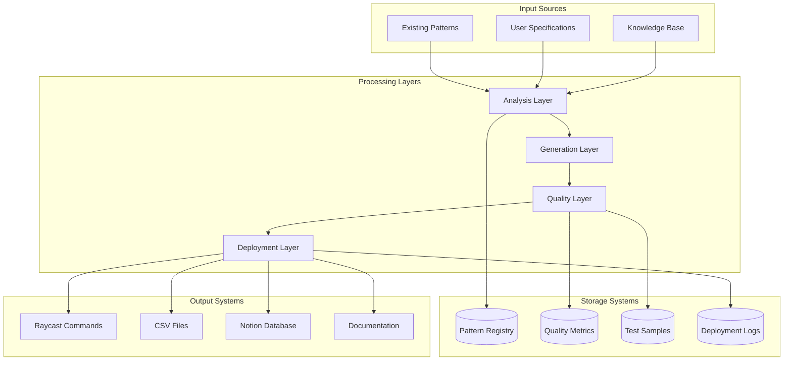
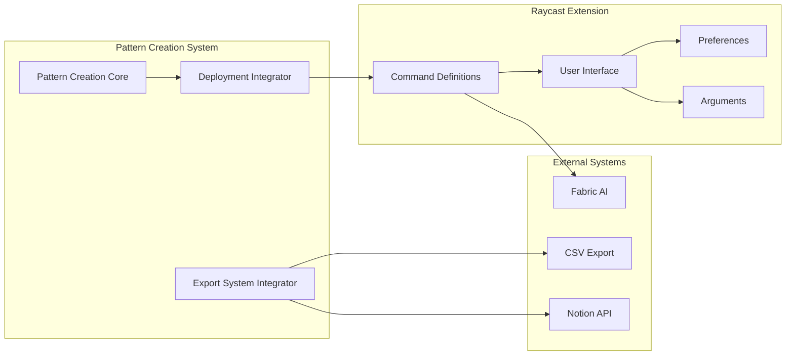
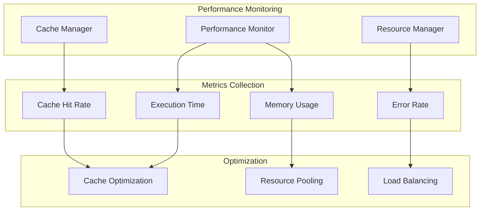
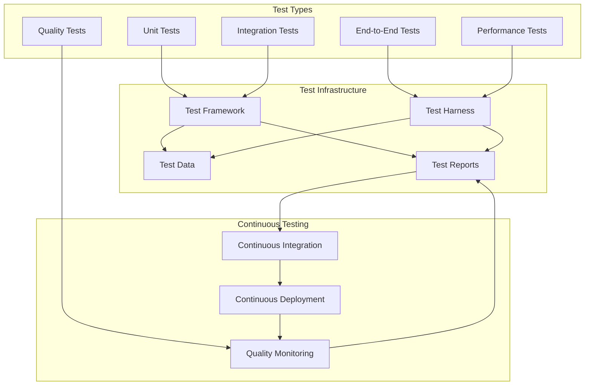
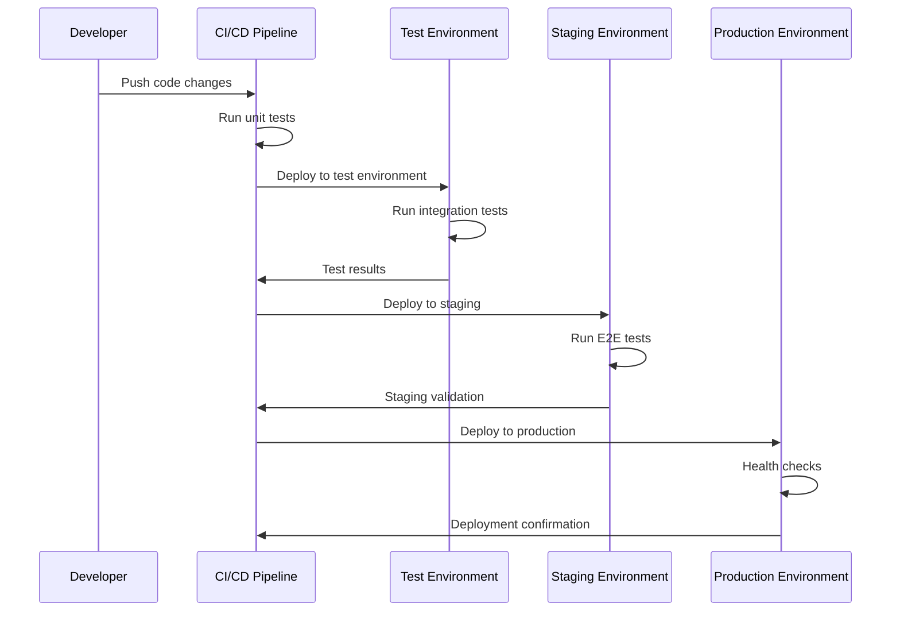
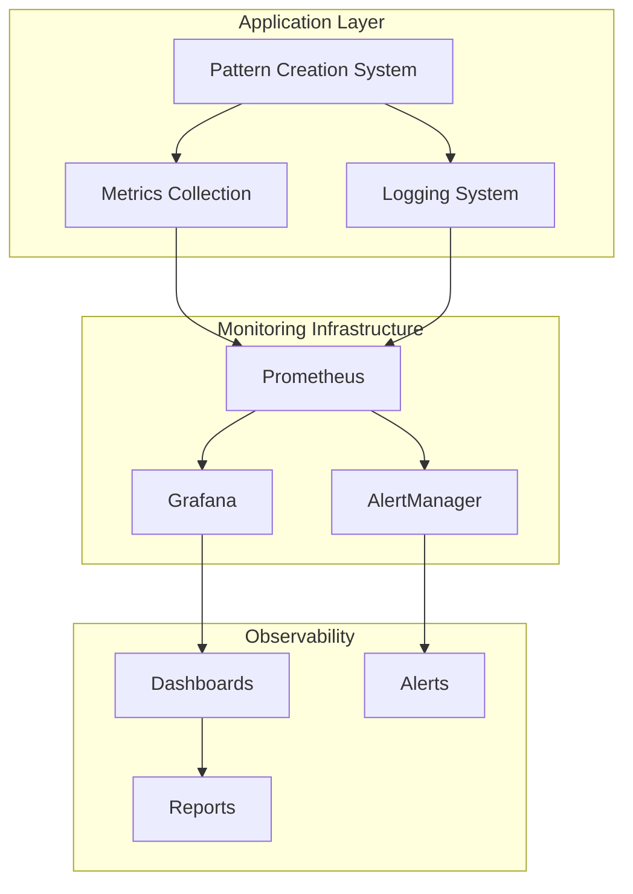

# Custom Pattern Creation - System Architecture

## 🏗️ Architecture Overview

**System**: Custom Pattern Creation Framework  
**Version**: 1.0  
**Architecture Style**: Modular TypeScript Class-Based System  
**Integration**: Raycast Extension Ecosystem  
**Last Updated**: ${new Date().toISOString()}

---

## 📐 High-Level Architecture



---

## 🔧 Component Architecture

### Core System Components

#### 1. Pattern Development Pipeline


#### 2. Quality Assurance Pipeline


#### 3. Deployment & Integration Pipeline


---

## 🏛️ Architectural Patterns

### 1. Modular Class-Based Design

Each component is implemented as an independent TypeScript class with:
- **Single Responsibility**: Each class handles one specific aspect
- **Dependency Injection**: Classes accept configuration options
- **Interface Segregation**: Clear interfaces for each component
- **Open/Closed Principle**: Extensible without modification

```typescript
// Example architectural pattern
interface ComponentInterface {
  process(input: InputType): OutputType;
  validate(input: InputType): ValidationResult;
  configure(options: ConfigOptions): void;
}

abstract class BaseComponent implements ComponentInterface {
  protected config: ConfigOptions;
  protected logger: Logger;
  
  constructor(options?: ConfigOptions) {
    this.config = { ...DEFAULT_CONFIG, ...options };
    this.logger = new Logger(this.constructor.name);
  }
  
  abstract process(input: InputType): OutputType;
  abstract validate(input: InputType): ValidationResult;
  
  configure(options: ConfigOptions): void {
    this.config = { ...this.config, ...options };
  }
}
```

### 2. Pipeline Architecture

The system uses a pipeline architecture for processing:
- **Sequential Processing**: Each stage builds on the previous
- **Error Handling**: Failures at any stage are handled gracefully
- **Monitoring**: Each stage can be monitored independently
- **Rollback**: Failed deployments can be rolled back

### 3. Event-Driven Architecture

Components communicate through events:
- **Loose Coupling**: Components don't directly depend on each other
- **Scalability**: Easy to add new components or modify existing ones
- **Monitoring**: All events can be logged and monitored
- **Testing**: Easy to mock events for testing

---

## 💾 Data Architecture

### Data Flow Diagram


### Data Models

#### Pattern Data Model
```typescript
interface PatternData {
  id: string;
  name: string;
  version: string;
  category: string;
  
  structure: {
    identity: string;
    purpose: string;
    steps: StepData[];
    output: OutputFormat;
  };
  
  metadata: {
    created: Date;
    updated: Date;
    author: string;
    tags: string[];
  };
  
  quality: {
    score: number;
    assessments: QualityAssessment[];
    lastTested: Date;
  };
  
  deployment: {
    status: DeploymentStatus;
    environment: string;
    version: string;
    lastDeployed: Date;
  };
}
```

#### Quality Data Model
```typescript
interface QualityData {
  patternId: string;
  timestamp: Date;
  
  scores: {
    overall: number;
    clarity: number;
    completeness: number;
    usability: number;
    effectiveness: number;
  };
  
  tests: {
    passed: number;
    failed: number;
    warnings: number;
    details: TestResult[];
  };
  
  recommendations: Recommendation[];
  trends: QualityTrend[];
}
```

---

## 🔌 Integration Architecture

### Raycast Extension Integration



### Export System Integration

The system integrates with multiple export formats:

#### CSV Export Architecture
```typescript
interface CSVExportConfig {
  format: 'standard' | 'extended' | 'custom';
  columns: ColumnDefinition[];
  includeMetadata: boolean;
  includeQualityScores: boolean;
}

class CSVExporter {
  export(data: PatternResult[], config: CSVExportConfig): string {
    // Implementation handles:
    // - Data transformation
    // - Column mapping
    // - Format validation
    // - Error handling
  }
}
```

#### Notion Export Architecture
```typescript
interface NotionExportConfig {
  databaseId: string;
  propertyMapping: PropertyMapping;
  includeRichText: boolean;
  createPages: boolean;
}

class NotionExporter {
  async export(data: PatternResult[], config: NotionExportConfig): Promise<NotionResult> {
    // Implementation handles:
    // - API authentication
    // - Property mapping
    // - Rich text formatting
    // - Error recovery
  }
}
```

---

## 🔒 Security Architecture

### Security Layers

1. **Input Validation**: All inputs are validated and sanitized
2. **Authentication**: API keys and tokens are securely managed
3. **Authorization**: Role-based access to different functions
4. **Data Protection**: Sensitive data is encrypted at rest and in transit
5. **Audit Logging**: All operations are logged for security monitoring

### Security Implementation

```typescript
interface SecurityConfig {
  enableInputValidation: boolean;
  enableAuditLogging: boolean;
  encryptSensitiveData: boolean;
  requireAuthentication: boolean;
}

class SecurityManager {
  validateInput(input: any, schema: ValidationSchema): ValidationResult {
    // Implement input validation
  }
  
  encryptData(data: string): string {
    // Implement encryption
  }
  
  auditLog(operation: string, user: string, details: any): void {
    // Implement audit logging
  }
}
```

---

## 📊 Performance Architecture

### Performance Optimization Strategies

1. **Lazy Loading**: Components are loaded only when needed
2. **Caching**: Frequently accessed data is cached
3. **Batch Processing**: Multiple operations are batched together
4. **Async Processing**: Long-running operations are asynchronous
5. **Resource Pooling**: Expensive resources are pooled and reused

### Performance Monitoring



### Performance Metrics

```typescript
interface PerformanceMetrics {
  executionTime: {
    average: number;
    p95: number;
    p99: number;
  };
  
  memoryUsage: {
    current: number;
    peak: number;
    average: number;
  };
  
  cachePerformance: {
    hitRate: number;
    missRate: number;
    evictionRate: number;
  };
  
  errorRates: {
    total: number;
    byCategory: { [category: string]: number };
  };
}
```

---

## 🧪 Testing Architecture

### Testing Strategy

1. **Unit Testing**: Each component is tested in isolation
2. **Integration Testing**: Component interactions are tested
3. **End-to-End Testing**: Complete workflows are tested
4. **Performance Testing**: System performance is validated
5. **Quality Testing**: Pattern quality is continuously monitored

### Test Architecture



---

## 🔄 Deployment Architecture

### Deployment Pipeline



### Environment Configuration

```typescript
interface EnvironmentConfig {
  name: 'development' | 'staging' | 'production';
  
  database: {
    host: string;
    port: number;
    credentials: DatabaseCredentials;
  };
  
  apis: {
    fabric: APIConfig;
    notion: APIConfig;
    raycast: APIConfig;
  };
  
  features: {
    enableMetrics: boolean;
    enableCaching: boolean;
    enableAuditLogging: boolean;
  };
  
  performance: {
    timeout: number;
    retryAttempts: number;
    cacheSize: number;
  };
}
```

---

## 📈 Scalability Architecture

### Horizontal Scaling

The system is designed to scale horizontally:
- **Stateless Components**: All components are stateless
- **Load Distribution**: Work can be distributed across multiple instances
- **Database Sharding**: Data can be partitioned across multiple databases
- **Caching Layer**: Distributed caching reduces database load

### Vertical Scaling

The system can also scale vertically:
- **Resource Optimization**: Components use resources efficiently
- **Memory Management**: Proper memory cleanup prevents leaks
- **CPU Optimization**: Algorithms are optimized for performance
- **I/O Optimization**: Database and file operations are optimized

---

## 🔍 Monitoring & Observability

### Monitoring Stack



### Key Metrics

1. **System Metrics**: CPU, memory, disk usage
2. **Application Metrics**: Request rate, response time, error rate
3. **Business Metrics**: Pattern creation rate, quality scores, user satisfaction
4. **Quality Metrics**: Test pass rate, deployment success rate, bug rate

---

**This architecture document provides a comprehensive overview of the Custom Pattern Creation system design, ensuring scalability, maintainability, and reliability for production deployment.**

Generated: ${new Date().toISOString()}  
Version: 1.0  
Status: Complete Architecture Documentation